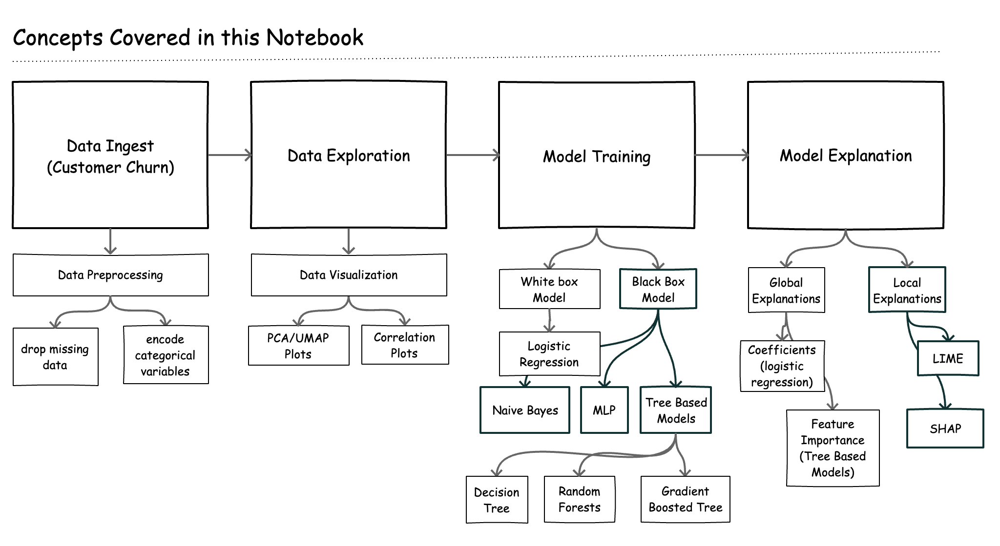
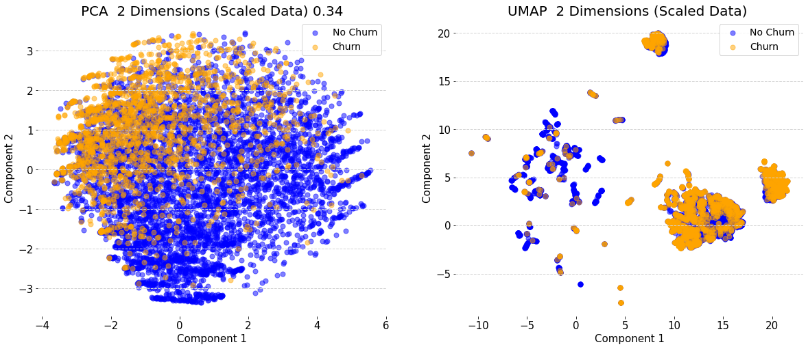
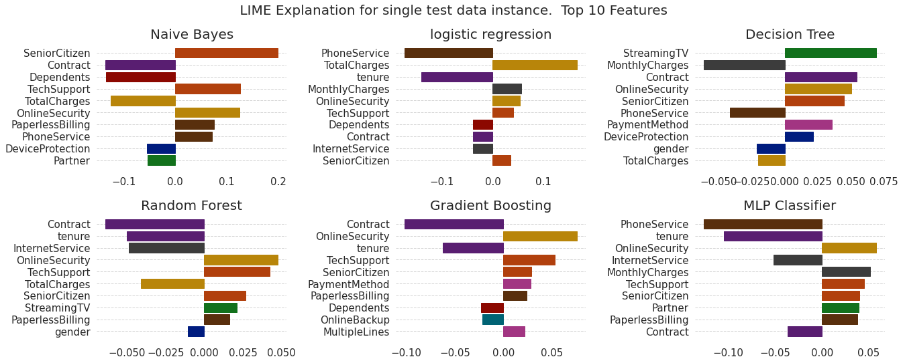
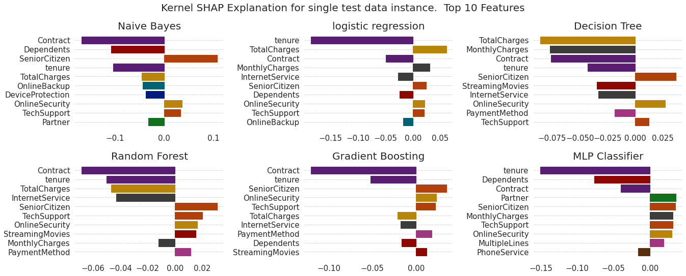

# Explaining Models with LIME and SHAP

> This repository provides a [notebook](explainability.ipynb) with examples in explaining 6 models (Naive Bayes, Logistic Regression, Decision Tree, Random Forest, Gradient Boosted Tree, Multilayer Perceptron) using LIME and SHAP.

At [Cloudera Fast Forward](https://www.cloudera.com/products/fast-forward-labs-research.html), we see model interpretability as an important step in the data science workflow. Being able to explain how a model works serves many purposes, including building trust in the model's output, satisfying regulatory requirements, model  debugging, and verifying model safety, amongst other things. We have written a research report (access it free [here](https://ff06-2020.fastforwardlabs.com/)) that discusses this topic in detail.
In this article, we revisit two industry standard algorithms for interpretability - LIME and SHAP. We discuss how these two algorithms work, and show some code examples of how to implement them in Python. At the end of this [notebook](explainability.ipynb), you should be familiar with:

- An overview of model interpretability
- Interpreting white box models, such as Linear/Logistic Regression (using model coefficients) and Tree models (using feature importance scores)
- Interpreting black box models with LIME and SHAP (KernelExplainer, TreeExplainer) and how to implement this in Python
- Good practices for "debugging" LIME and SHAP explanations
- Limitations of LIME/SHAP (a.k.a., when to choose LIME over SHAP)

---

##### Figure 1. Plots of UMAP and PCA dimensionality reduction (two dimensions) applied to the dataset. 

##### Figure 2. Local explanations created with LIME for a given test data instance across 6 models.  

##### Figure 3. Local explanations created with SHAP Kernel Explainer for a given test data instance across 6 models.

Figure 2 and 3 above show the local explanations created with LIME and SHAP for a given test data instance across 6 models. We see agreement in magnitude and direction across all models for both explanation methods (except for the Decision Tree).

## LIME vs SHAP : When to Use What?

LIME and SHAP are both good methods for explaining models. In theory, SHAP is the better approach as it provides mathematical guarantees for the accuracy and consistency of explanations. In practice, the model agnostic implementation of SHAP (KernelExplainer) is slow, even with approximations. This speed issue is of much less concern if you are using a tree based model and can take advantage of the optimizations implemented in SHAP TreeExplainer (we saw it could be up to 100x faster than KernelExplainer).

Some additional limitations of both methods are mentioned below:

- LIME is not designed to work with one hot encoded data. Considering that each data point is perturbed to create the approximate model, perturbing a one hot encoded variable may result in unexpected (meaningless) features. See discussion [here](https://github.com/marcotcr/lime/issues/153).
- LIME depends on the ability to perturb samples in meaningful ways. This perturbation is use case specific. E.g., for tabular data, this entails adding random noise to each feature; for images, this entails replacing superpixels within the image with some mean value or zeroes; for text, this entails removing words from the text. It is often useful to think through any side effects of these perturbation strategies with respect to your data to further build trust in the explanation.
- In some cases, the local model built by LIME may fail to approximate the behaviour of the original model. It is good practice to check for such inconsistencies before trusting LIME explanations.

- LIME works with models that output probabilities for classification problems. Models like SVMs are not particularly designed to output probabilities (though they can be coerced into this with some [issues](https://scikit-learn.org/stable/modules/svm.html).). This may introduce some bias into the explanations.

- SHAP depends on background datasets to infer a baseline/expected value. For large datasets, it is computationally expensive to use the entire dataset and we have to rely on appromixations (e.g. subsample the data). This has implications for the accuracy of the explanation.

- SHAP explains the deviation of a prediction from the expected/baseline value which is estimated using the training dataset. Depending on the specific use case, it may be more meaningful to compute the expected value using a specific subset of the training set as opposed to the entire training set. For example, it may be more meaningful to explain a churn prediction with respect to how it deviates from customers who did not churn. Here, we might want to use the dataset of customers who did not churn as our background dataset. See this issue [here](https://github.com/slundberg/shap/issues/435).

---

## Deploying on Cloudera Machine Learning (CML)

There are three ways to launch this notebook on CML:

1. **From Prototype Catalog** - Navigate to the Prototype Catalog in a CML workspace, select the "Explaining Models with LIME and SHAP" tile, click "Launch as Project", click "Configure Project"
2. **As ML Prototype** - In a CML workspace, click "New Project", add a Project Name, select "ML Prototype" as the Initial Setup option, copy in the [repo URL](https://github.com/cloudera/CML_AMP_Explainability_LIME_SHAP), click "Create Project", click "Configure Project"
3. **Manual Setup** - In a CML workspace, click "New Project", add a Project Name, select "Git" as the Initial Setup option, copy in the [repo URL](https://github.com/cloudera/CML_AMP_Explainability_LIME_SHAP), click "Create Project".

Once the project has been initialized in a CML workspace, run the notebook by starting a Python 3 Jupyter notebook server session with at least 4GB of RAM. All library and model dependencies are installed inline in the notebook.